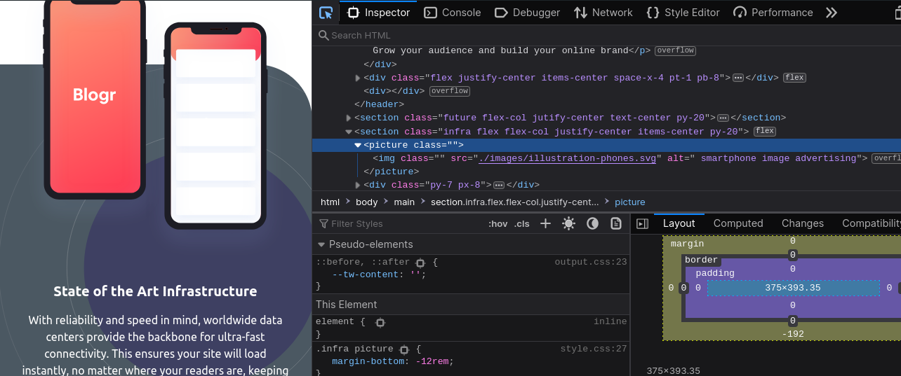

# Blogr landing page solution

### Overview
 
Este projeto é uma solução para a página de destino do Blogr, criada usando Tailwind CSS, JavaScript e HTML5

    

### Para visualizar o projeto localmente, siga estas etapas:

1. Clone o repositório para o seu computador usando o comando sh:
 git clone https://github.com/Edsonromeumaier/Blogr-landingpage3.git

+ Certifique-se de que você tenha o Node.js e o npm instalados e atualizados em seu computador. 
+ No diretório do projeto, instale as dependências executando o seguinte comando:npm install
+ Após a conclusão da instalação, inicie o servidor de desenvolvimento com o seguinte comando: npm run start

2. Você também pode usar a ferramenta de visualização GitHub & BitBucket para uma visualização rápida. Basta copiar o caminho relativo do arquivo index.html e colá-lo na ferramenta de visualização:[github & BitBucket HTML preview](https://htmlpreview.github.io/)

### Links

- Solution URL: [Blogr3](https://github.com/Edsonromeumaier/Blogr-landingpage3)
- Live Site URL: [Blogr3 live ](#)

